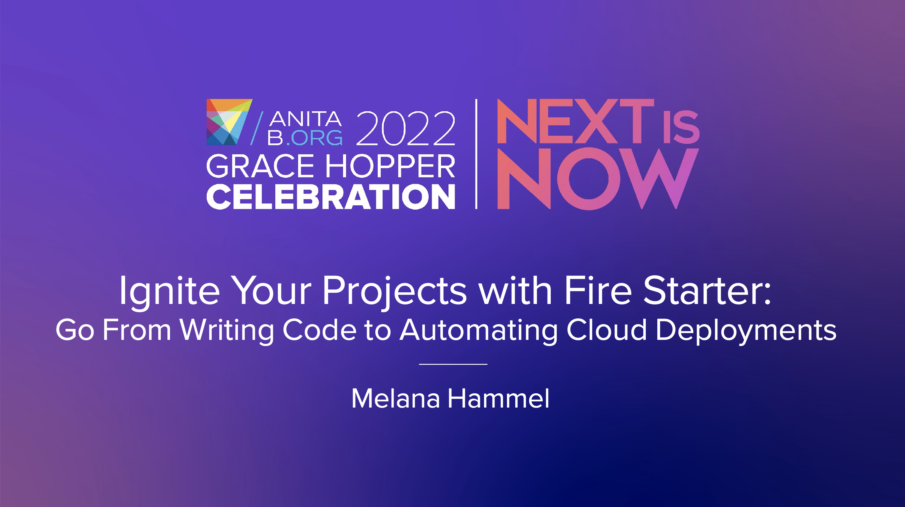
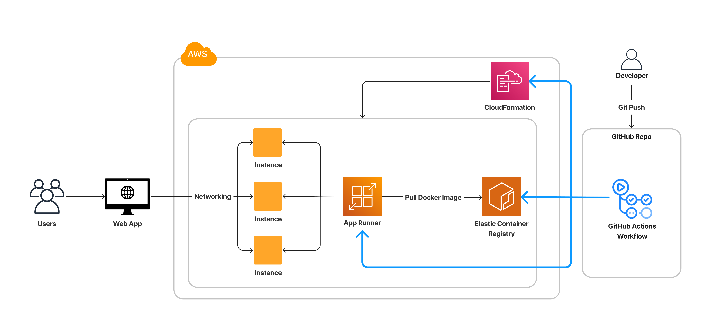

# Fire Starter

Fire Starter is a Github template repository that you can use it to take a 
website running locally on your machine and deploy it to the cloud using 
Docker, GitHub Actions, and AWS App Runner.

Please feel free to open an issue if you have any questions or issues. 

## Table of Contents
1. [Presentation Slides](#presentation-slides)
2. [Architecture](#architecture)
3. [Getting Started](#getting-started)
4. [Sources and Tutorials](#sources-and-tutorials)

## Presentation Slides

I built Fire Starter for a talk I gave at the 2022 Grace Hopper Celebration (GHC22). 
Here are the slides from my talk:

[](./ghc22_presentation/ghc22_slides.pdf)

## Architecture



* A developer can trigger different GitHub Actions workflows by pushing a commit or merging to a certain branch.
  * These workflows are in `./github/workflows/`.
* The GitHub Actions workflows do the following tasks automatically when triggered:
  * Use AWS CloudFormation to create cloud infrastructure resources for the website in AWS
  * Build and upload Docker container images of the website into AWS Elastic Container Registry (ECR)
  * Set up AWS App Runner to pull the most recent Docker image for the website from ECR
  * Create App Runner instances running the website ready to receive live traffic

## Getting Started

To get started, copy this template repository to create a new repository by clicking "Use this template" on the GitHub home page of this repository.

### 1. Create Website

To create and run your website, you will need `npm` and `node 16` installed.
Then in the directory where your code is downloaded, run:

```bash
cd example-react-app/
npm run start
```

Go to [localhost:3000](http://localhost:3000/) and your website will be running.

### 2. Containerize

To use Docker, you will need Docker installed.
To run your website out of a Docker container, run:
```bash
docker build -t fire-starter .
docker run -p 3000:3000 fire-starter
```

Go to [localhost:3000](http://localhost:3000/) and your website will be running.

### 3. Automate

Several of the GitHub Actions workflows will run automatically if you make a new commit to your repo.
These include "Run Tests" (`./github/workflows/test.yaml`) and "Build Image" (`./github/workflows/build.yaml`).
Go to the `Actions` tab in the GitHub UI to explore actions.

To run the other workflows, follow the steps in the `Deploy` section below.

### 4. Deploy

To deploy your website, you will need to [create an AWS account](https://docs.aws.amazon.com/accounts/latest/reference/manage-acct-creating.html).

Note: Some of the AWS infrastructure for this website will cost money to run, so please be aware.

After creating your AWS account, you will need to set up your AWS credentials to authorize GitHub Actions.

#### Set Up
1. Go to the AWS console and [create a stack](https://docs.aws.amazon.com/AWSCloudFormation/latest/UserGuide/cfn-console-create-stack.html)
in CloudFormation using this template: `./cloudformation/github_iam_role.yaml`.
This will create an IAM role for you to use. 
2. Copy the ARN of the `github-user-role` IAM role you created.
3. [Create a secret in GitHub Actions](https://docs.github.com/en/actions/security-guides/encrypted-secrets) and call it `AWS_GITHUB_ROLE_ARN` and enter the value of the arn from step 2.
4. Run the "Deploy CloudFormation" action (`/.github/workflows/deploy_cloudformation.yaml`). This will set up AWS infrastructure for ECR and App Runner and create another IAM role.
5. Copy the arn of the `app-runner-service-role` IAM role you created.
6. Create a secret in GitHub Actions and call it `AWS_APP_RUNNER_ROLE_ARN` and enter the value of the arn from step 5.

Now you are ready to deploy your site.

1. Run the "Build and Deploy" action (`/.github/workflows/build_and_deploy.yaml`).
This will deploy your website using App Runner.
2. Go to the AWS console and go to the App Runner service. You will see a service called 
`fire-starter-service`. It should have a default domain attached to it. 
3. Click on the default domain and you should see your website running!

### Sources and Tutorials

#### Sources
* [React](https://reactjs.org/) by React
* [What are containers?](https://cloud.google.com/learn/what-are-containers) by Google Cloud
* [What is a container?](https://www.docker.com/resources/what-container/) by Docker
* [Well-Architected Framework](https://aws.amazon.com/blogs/apn/the-6-pillars-of-the-aws-well-architected-framework/) by AWS
* [What is AWS App Runner?](https://docs.aws.amazon.com/apprunner/latest/dg/what-is-apprunner.html) by AWS
* [7 Places to host your Jamstack site](https://www.pluralsight.com/blog/software-development/where-to-host-your-jamstack-site) by Pluralsight
* [AWS CloudFormation Concepts](https://docs.aws.amazon.com/AWSCloudFormation/latest/UserGuide/cfn-whatis-concepts.html) by AWS
* [What is CI/CD?](https://about.gitlab.com/topics/ci-cd/) by GitLab
* [What is GitHub Actions?](https://assets.ctfassets.net/wfutmusr1t3h/6IyfnYAidl3QUoX2xfGOgI/6aa9e5df02378f952f7c1ba5f42effc9/What-is-GitHub.Actions_.Benefits-and-examples.pdf) by GitHub
* [An Illustrated Guide to OAuth and OpenID Connect](https://developer.okta.com/blog/2019/10/21/illustrated-guide-to-oauth-and-oidc) by Okta

#### Tutorials 
* [Create React App](https://github.com/facebook/create-react-app#create-react-app--)
* [Docker](https://docs.docker.com/get-started/)
* [AWS App Runner](https://docs.aws.amazon.com/apprunner/latest/dg/getting-started.html)
* [GitHub Actions](https://docs.github.com/en/actions/quickstart)
* [Configuring OpenID Connect in AWS by Github](https://docs.github.com/en/actions/deployment/security-hardening-your-deployments/configuring-openid-connect-in-amazon-web-services)
* [Deploy applications in AWS App Runner with Github Actions by AWS](https://aws.amazon.com/blogs/containers/deploy-applications-in-aws-app-runner-with-github-actions/)


